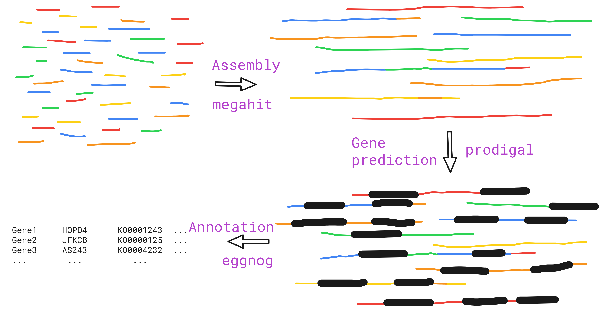
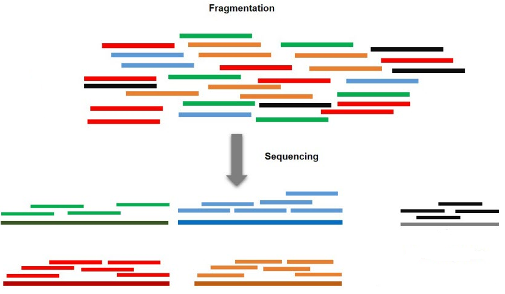
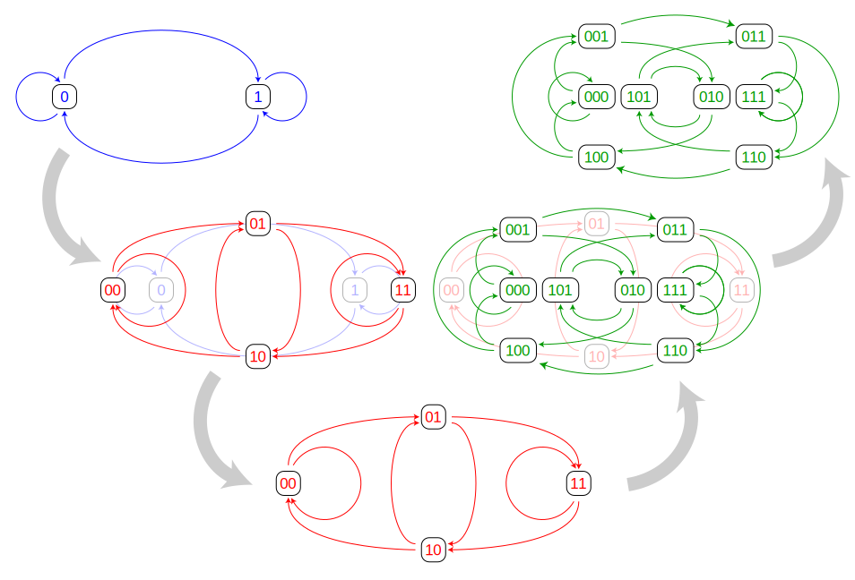

```{r setup, include=FALSE}
knitr::opts_chunk$set(echo = FALSE,
                      fig.align='center')
```

<!-- 
  A Luke Markdown ioslides Theme.
  2018-06-01 v. 1.0.0
  Contact: Daniel Fischer <daniel.
  fischer@luke.fi>

  This is free software: you can redistribute it and/or modify
  it under the terms of the GNU General Public License as published by
  the Free Software Foundation, either version 3 of the License, or
  (at your option) any later version.

  This is distributed in the hope that it will be useful,
  but WITHOUT ANY WARRANTY; without even the implied warranty of
  MERCHANTABILITY or FITNESS FOR A PARTICULAR PURPOSE.  See the
  GNU General Public License for more details.

  You can find the GNU General Public License at <http://www.gnu.org/licenses/>.
--> 


# Learning outcome

## Learning outcome
<div class="my-footer">Learning outcome</div> 

After this session you are able to use quality filtered raw reads for:

* assembling a metagenome
* perform gene predictions
* functional annotate those predicted genes

using singularity containers.


## Graphical abstract
<div class="my-footer">Graphical abstract</div> 

```{r, out.width = "100%", include=TRUE, fig.align="center", fig.cap=c(""), echo=FALSE}

```

# Metagenome assembly

## Metagenome assembly I
<div class="my-footer">Metagenome I</div> 

From yesterday we know that

* we collect DNA-sequences from microbes and sequence those
* reads are just randomly representing the underlying organisms
* reads do not necessary represent fully the underlying organisms

## Metagenome assembly II
<div class="my-footer">Metagenome II</div> 

Using Illumina sequencers, we typically have e.g. 2x150bp reads

Reads come from all over the place, but if they are arranged based on their nucleotide sequence, we find some overlap between them

Some of the reads do not share any subsequence and some share a whole bunch of nucleotides

Creating a Metagenome is in essence assembling the reads to so-called **Contigs** by finding similarities between the reads
and then merge them down

## Metagenome assembly III
<div class="my-footer">Metagenome assembly III</div> 

```{r, out.width = "100%", include=TRUE, fig.align="center", fig.cap=c(""), echo=FALSE}

```

## Metagenome assembly IV
<div class="my-footer">Metagenome IV</div> 

While assembling Contigs looks like a trivial problem, it proofed to be a major computational problem

Computer scientists developed various algorithms and data strucutures to solve the alignment problem 

* without running out of memory
* without running out of time

The most commonly used data structure is the De Bruijn graph, a structure of directed graphs that represent overlaps between sequences.

## Metagenome assembly V
<div class="my-footer">Metagenome assembly V</div> 

```{r, out.width = "80%", include=TRUE, fig.align="center", fig.cap=c(""), echo=FALSE}

```


## Metagenome assembly VI
<div class="my-footer">Metagenome VI</div> 

Assembly strategy? We have _n_ samples, what to do? 

Creating a metagenome for each sample might create a huge mess in the downstream analysis.

Can we expect to get the same contigs across different samples?

What could be a better strategy?


## Metagenome assembly VII
<div class="my-footer">Metagenome VII</div> 

It is better to merge all the samples together into one single file (respective file-pair).

Using bash/Linux this is an easy exercise:

```
cat *_R1.fastq.gz > allSamples_R1.fastq.gz
cat *_R2.fastq.gz > allSamples_R2.fastq.gz
```

`cat :` takes a set of files as input and concatenates them.

`*      :` Wildcard character, basically interpreted as "whatever"

`>      :` redirects the output from a function into a file

## Metagenome assembly VIII
<div class="my-footer">Metagenome assembly VIII</div> 

We will use **megahit** to perform the assembly of our reads.

Basic use:
```
megahit -1 pe_R1.fastq.gz -2 pe_R2.fastq.gz -o out
```

GitHub: https://github.com/voutcn/megahit

Li, D., Liu, C-M., Luo, R., Sadakane, K., and Lam, T-W., (2015) MEGAHIT: An ultra-fast single-node solution for large and complex metagenomics assembly via succinct de Bruijn graph. Bioinformatics, doi: https://doi.org/10.1093/bioinformatics/btv033.

## Metagenome assembly IX
<div class="my-footer">Metagenome assembly IX</div> 

Let's switch to the first exercise block and learn

* to start a singularity container
* to concatenate our data
* to assembly our first metagenome

Exercise 1

## Metagenome assembly X
<div class="my-footer">Metagenome assembly X</div> 
Other steps that are here now omitted

* Visualise the metagenome e.g. via `bandage`

Github: https://github.com/rrwick/Bandage/wiki

* Filter the metagenome by length (e.g. trim everything under 2000bp), e.g. via `awk`


# Metagenome annotation

## Metagenome annotation I
<div class="my-footer">Metagenome annotation I</div>

Having a metagenome is nice, but it does not provide any further insights!

We are, among others, interested in bioactive areas we captured with our biosamples. 

However, as we deal with DNA and not RNA, we cannot say directly what parts of our metagenome are transcribed to RNA or translated to proteins.

For that, we need to predict genes on our metagenome.

## Metagenome annotation II
<div class="my-footer">Metagenome annotation II</div>

We use `prodigal` for gene prediction, it is a tool especially designed for gene prediction on procaryotic genomes.

Github: https://github.com/hyattpd/Prodigal

Reference: Hyatt, D., Chen, GL., LoCascio, P.F. et al. Prodigal: prokaryotic gene recognition and translation initiation site identification. BMC Bioinformatics 11, 119 (2010). https://doi.org/10.1186/1471-2105-11-119


## Metagenome annotation III
<div class="my-footer">Metagenome annotation III</div>

In its basic use, `prodigal` is equally easy to use as `megahit`
```
  prodigal -i input.fa -o output.gtf -a output.fa -p meta -f gff
```

By default, Prodigal produces a Genbank-like feature table, hence we specify `-f gff`to get the output in gff3 format.

Further, we need to set `-p meta`, the runmode optimised for metagenomics

## Metagenome annotation IV
<div class="my-footer">Metagenome annotation IV</div>

Let's feed our metagenome into `prodigal` and predict some genes!

Exercise 2.

## Prodigal output I
<div class="my-footer">Prodigal output I</div>
The prodigal main output is a gff file (`-o` -Option), containing among others

* Comments and metainformation (starting with `#`)
* Chromosome/Contig of annotation
* Start/End bp of predicted gene
* Identifier
* ...

## Prodigal output II
<div class="my-footer">Prodigal output II</div>

Understanding the gtf-output (`#` header metadata):

* __seqnum__: An ordinal ID for this sequence, beginning at 1.
* __seqlen__: Number of bases in the sequence.
* __seqhdr__: The entire FASTA header line.
* __version__: Version of Prodigal used to analyze this sequence.

## Prodigal output III
<div class="my-footer">Prodigal output III</div>

* __run_type__: "Ab initio" for normal mode, "Anonymous" for anonymous mode.
* __model__ (Anonymous mode only): Information about the preset training file used to analyze the sequence.
* __gc_cont__: % GC content of the sequence.
* __transl_table__: The genetic code used to analyze the sequence.
* __uses_sd__: Set to 1 if Prodigal used its default RBS finder, 0 if it scanned for other motifs.

## Prodigal output IV
<div class="my-footer">Prodigal output IV</div>

Understanding the gtf-output (Gene "Column 9" metadata):

* __ID__: A unique identifier for each gene, consisting of the ordinal ID of the sequence and an ordinal ID of that gene within the sequence
* __partial__: An indicator of if a gene runs off the edge of a sequence or into a gap. A "0" indicates the gene has a true boundary (a start or a stop), whereas a "1" indicates the gene is "unfinished" at that edge (i.e. a partial gene). For example, "01" means a gene is partial at the right boundary, "11" indicates both edges are incomplete, and "00" indicates a complete gene with a start and stop codon.

## Prodigal output V
<div class="my-footer">Prodigal output V</div>

* __start_type__ : The sequence of the start codon (usually ATG, GTG, or TTG). If the gene has no start codon, this field will be labeled "Edge".
* __rbs_motif__: The RBS motif found by Prodigal (e.g. "AGGA" or "GGA", etc.)
* __rbs_spacer__: The number of bases between the start codon and the observed motif.
* __gc_cont__: The GC content of the gene sequence.
* __conf__: A confidence score for this gene, representing the probability that this gene is real, i.e. 78.3% means Prodigal believes that gene is real 78.3% of the time and a false positive 21.7% of the time.

## Prodigal output VI
<div class="my-footer">Prodigal output VI</div>

* __score__: The total score for this gene.
* __cscore__: The hexamer coding portion of the score, i.e. how much this gene looks like a true protein.
* __sscore__: A score for the translation initiation site for this gene; it is the sum of the following three fields.
* __rscore__: A score for the RBS motif of this gene.
* __uscore__: A score for the sequence surrounding the start codon.
* __tscore__: A score for the start codon type (ATG vs. GTG vs. TTG vs. Nonstandard).

## Prodigal output VII
<div class="my-footer">Prodigal output VII</div>

The second prodigal output is a fasta-file (`-a`-option).


This file contains in fasta format two alternating rows per gene

1. A descriptive header (starting with ´>`)
2. The protein sequence of the predicted gene

# Functional annotation

## Functional annotation I
<div class="my-footer">Functional annotation I</div>

Having a genome and an annotation is nice!

But honestly, what can we do with it without knowing the gene functions?

Literally, all we have currently is a map and a telephone book with names, numbers and addresses.

If we need a certain service, this is close to useless, we would need to know what those guys on that book do for living to find the right person - we would need the yellow pages!

In other words - we need to functional annotate our predicted genes!

## Functional annotation II
<div class="my-footer">Functional annotation II</div>

There are different ways to do it, we will use here EggNOG for it.

EggNOG stands for "Evolutionary genealogy of genes: Non-supervised Orthologous Groups

It is a database hosted by EMBL and in its latest version it uses 5090 organisms, 2502 viruses and 4.4mio Orthologous groups.

A cluster of orthologous groups is a set of proteins that are highly similar and are assumed to have a common anchestor, so they divergered over time.

EggNOG uses the sequence similarity to place novel sequences into clusters and to assign then the corresponding function.

## Functional annotation III
<div class="my-footer">Functional annotation III</div>

There are two ways to use EggNOG:

1. Using the webinterface : http://eggnog.embl.de/
2. Using a local installation

For the second option, the required databases are required to be locally available, naturally.

## Functional annotation IV
<div class="my-footer">Functional annotation IV</div>

Running the eggnog mapper is slightly more complicated than the previous steps, but there is still no need to panic!

1. Download the eggnog databases
2. Create seed orthologs
3. Find orthologs and annotate

## Functional annotation V
<div class="my-footer">Functional annotation V</div>

First, we need to download three databases:

1. The main annotation database
2. The taxa database
3. DIAMOND database, contains eggnog proteins

There is a script for that:

```
download_eggnog_data.py --data_dir /path/to/outputfolder
```

## Functional annotation VI
<div class="my-footer">Functional annotation VI</div>

Once we have the databases in place, start a two-step process.

The first step is to search the proteins from the diamond database

```
emapper.py -m diamond --data_dir <folder> \
           --no_annot --no_file_comments \
           -i <input> -o <output>
```

## Functional annotation VII
<div class="my-footer">Functional annotation VII</div>

Once we finished the search we can run the annotation

```
emapper.py --data_dir <folder> \
           --annotate_hits_table <previous_output>\
           --no_file_comments -o <output>
```

## Functional annotation VIII
<div class="my-footer">Functional annotation VIII</div>

Let's go to exercise 3 and start the functional annotation!

## EggNOG output I
<div class="my-footer">EggNOG output I</div>

The EggNOG output might be a little overwhelming in the beginning, as tons of different annotations are provided already per default.

And more annotations could be added with extra options. For example PFAM needs to be turned on separately, as for this step another database needs to be obtains in a similar way as we did above for the default databases.

A complete overview of the EggNOG output can be found here:

https://github.com/eggnogdb/eggnog-mapper/wiki/eggNOG-mapper-v2.1.5-to-v2.1.7#Output_files


# And next?

## What's next
<div class="my-footer">What's next</div>

* With the annotation data we can dive into the hands-on work for the data, identify Cazy, KEGG orthologs, GO, etc.
* These steps are, however, not trivial
* And of course taxonomic annotation

# Thank you!